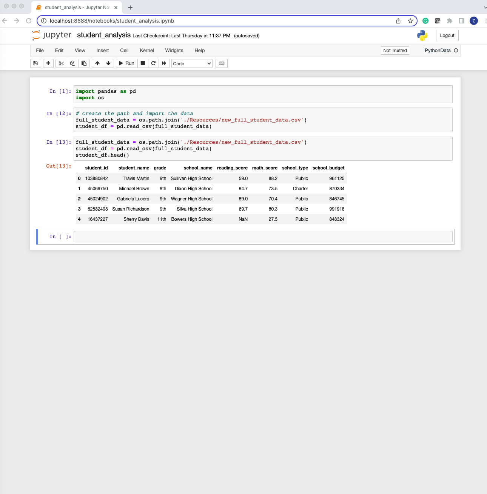
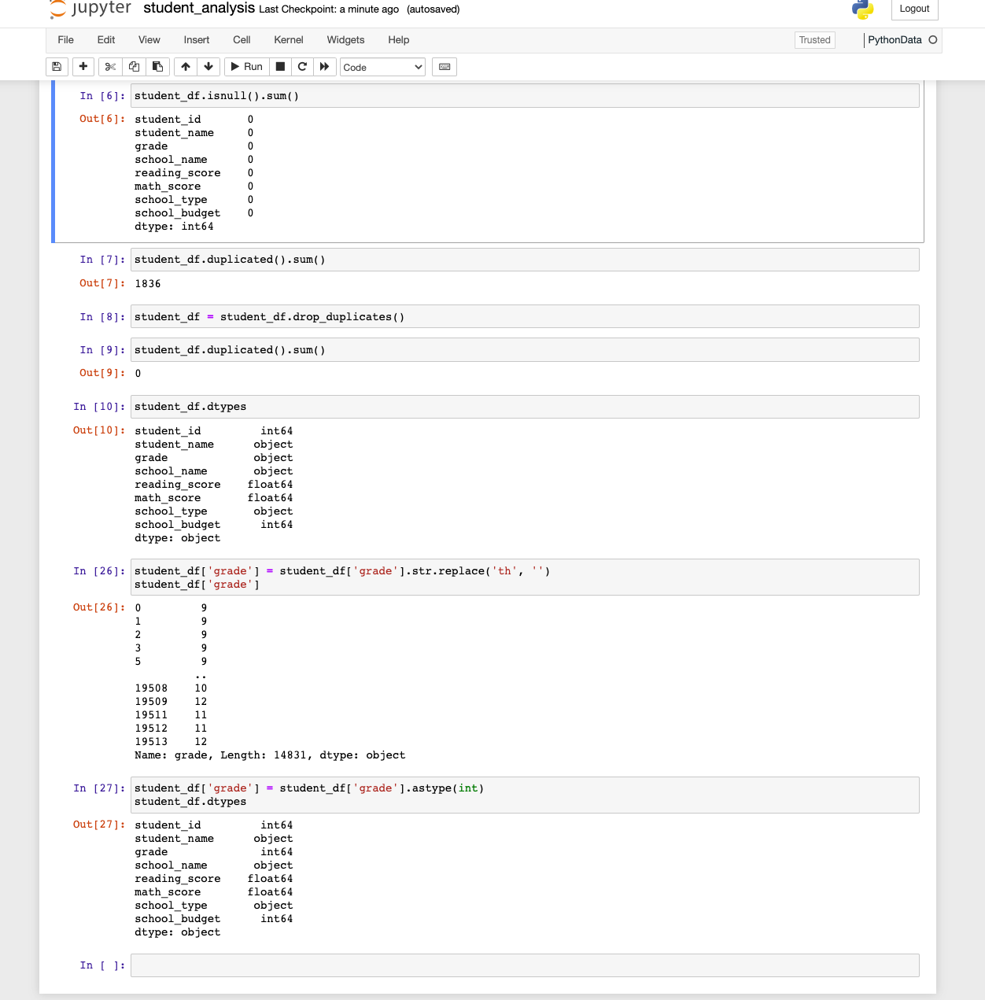
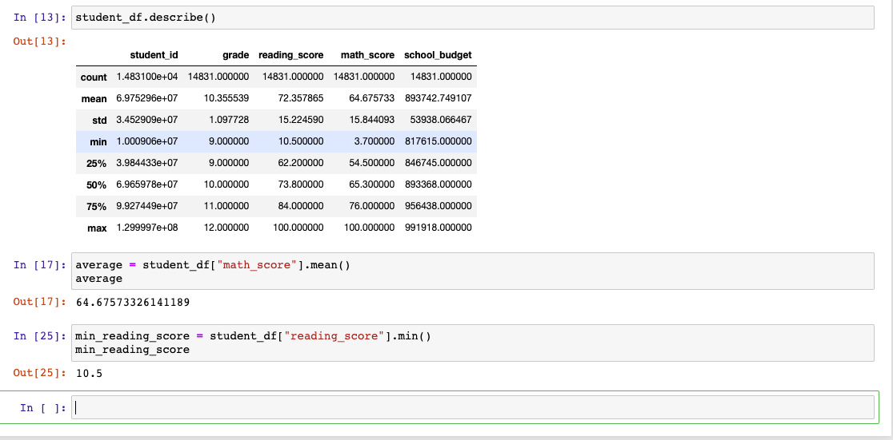
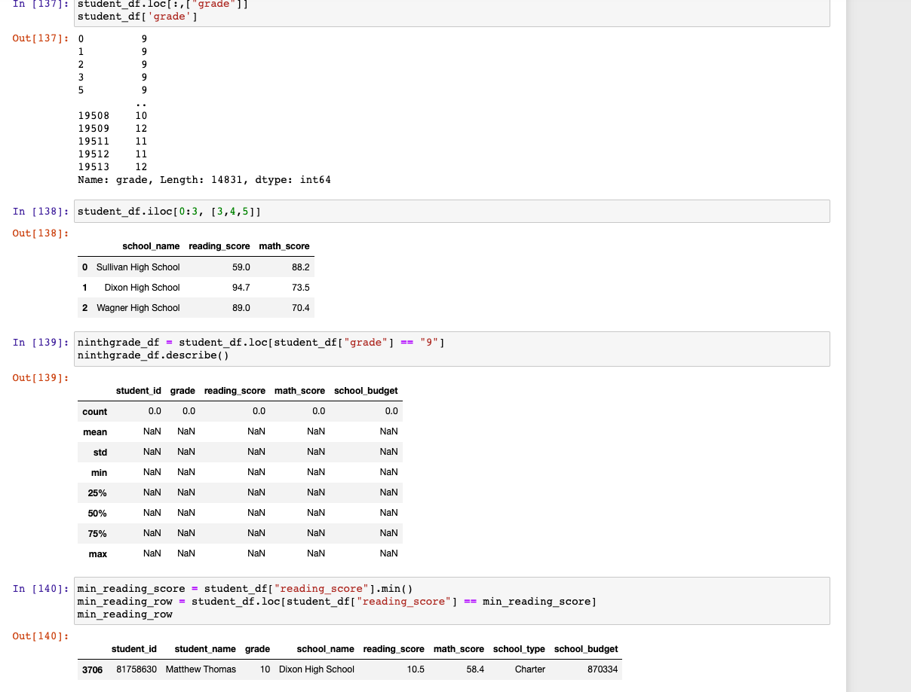
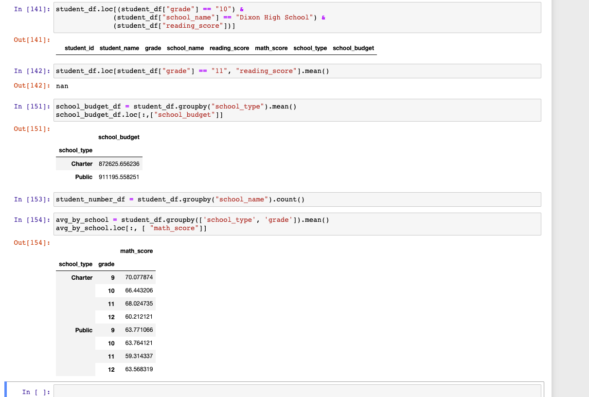

# School District Analysis
## Data Collection

## Data Preparation

## Summary of Data

## Drilling Down of Data

## Data Comparison

## Findings
Using Jupyter Notebook and Pandas, we provided an analysis of a city school district. We aggregated data, drilled it down, and used comparisons to showcase trends in school performance and by school type. Using this analysis we can compare student scores across schools and the district for reading and math, and show the differencs between the type of school. An interesting finding was the math scores by school type. Charter schools performed as a whole better, except for 12th grade which public schools perfromed significanly better on. We can also see stark differences in scores, such as reading scores for students at Sullivan High School that and Dixon High School. The students at Dixon performed on average about 35 points better than those at Sullivan on reading scores. These analysis can be very helpful for identifying areas of weakness at certain schools in the district. 
